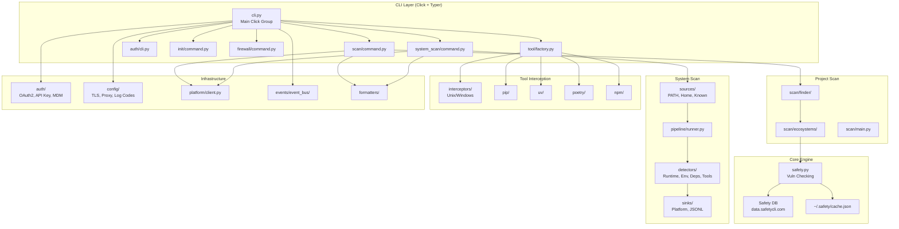
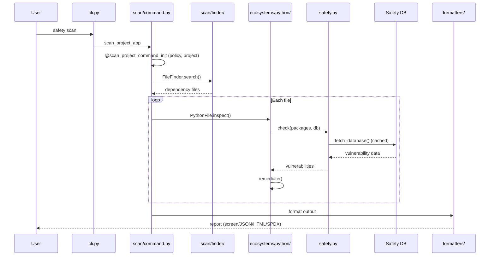
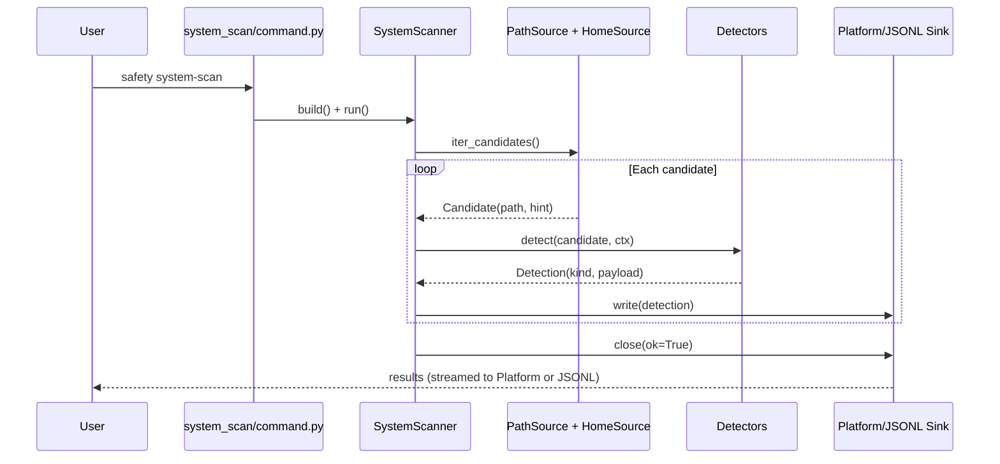
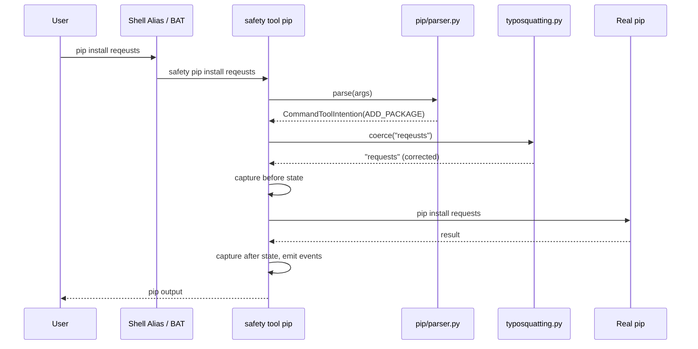

# Codebase Map

> Auto-generated by Cartographer. Last mapped: 2026-02-27

## System Overview

Safety CLI is a Python dependency vulnerability scanner that detects packages with known vulnerabilities and malicious packages. It scans local projects, CI/CD pipelines, and entire developer machines.



## Directory Structure

```
safety/                         # Main package (~250 source files)
├── cli.py                      # Main Click group entry point
├── safety.py                   # Core vulnerability checking engine
├── util.py                     # SafetyContext singleton, utilities
├── output_utils.py             # Output formatting and rendering
├── constants.py                # URLs, exit codes, config paths
├── errors.py                   # Two exception hierarchies (SafetyError + SafetyException)
├── error_handlers.py           # @handle_cmd_exception decorator
├── cli_util.py                 # Custom Click/Typer classes (CommandType, FeatureType, etc.)
├── decorators.py               # @notify decorator for event emission
├── console.py                  # Rich console with emoji handling
├── formatter.py                # Strategy pattern for output formats
├── meta.py                     # Version, user-agent, HTTP headers
├── encoding.py                 # File encoding detection (UTF-8/BOM)
├── logs_helpers.py             # @log_call logging decorator
├── asyncio_patch.py            # Patch for asyncio subprocess exception handling
├── codebase_utils.py           # Project config (.safety-project.ini) management
├── alerts/                     # GitHub PR/Issue creation
├── auth/                       # OAuth2 with PKCE, API key, MDM enrollment
│   ├── cli.py                  # Auth CLI commands (login, register, status, logout, enroll)
│   ├── main.py                 # OAuth2 flow, token refresh, org config
│   ├── oauth2.py               # OAuth2 protocol implementation
│   ├── enrollment.py           # MDM machine enrollment HTTP helper
│   ├── machine_id.py           # Machine ID generation for MDM
│   ├── models.py               # Auth, Organization, XAPIKeyAuth dataclasses
│   ├── server.py               # Local HTTP server for OAuth callback
│   ├── constants.py            # Auth-specific constants and messages
│   ├── cli_utils.py            # Auth CLI helper utilities
│   └── utils.py                # General auth utilities
├── codebase/                   # Codebase management commands
├── config/                     # TLS, proxy, auth config, log codes
│   ├── tls.py                  # TLS certificate configuration
│   ├── proxy.py                # Proxy configuration
│   ├── auth.py                 # Auth token persistence (~/.safety/auth.ini)
│   ├── main.py                 # Auth config file path constants
│   └── log_codes.py            # Structured log code constants (config.tls.*, config.proxy.*)
├── events/                     # Async event bus for telemetry
├── firewall/                   # Package installation firewall
├── formatters/                 # Screen, JSON, text, HTML, SPDX output
├── init/                       # Interactive setup wizard
├── models/                     # Core data models
│   ├── obj.py                  # SafetyCLI dataclass (central context object)
│   ├── vulnerabilities.py      # Vulnerability, CVE, Severity models
│   ├── requirements.py         # SafetyRequirement, Package models
│   └── tools.py                # ToolResult model
├── platform/                   # Safety Platform API client
│   ├── client.py               # SafetyPlatformClient (httpx), MachineTokenAuth
│   └── http_utils.py           # @parse_response decorator (retry, error mapping, TLS fallback)
├── scan/                       # Project vulnerability scanning
│   ├── command.py              # Typer CLI (scan_project_app)
│   ├── decorators.py           # @scan_project_command_init, @inject_metadata
│   ├── main.py                 # Policy loading, file processing
│   ├── render.py               # Rich console rendering
│   ├── init_scan.py            # Generator-based scan for init
│   ├── models.py               # Scan-specific models
│   ├── util.py                 # Git utilities (silently returns None on error)
│   ├── validators.py           # Scan input validators
│   ├── constants.py            # Scan constants
│   ├── ecosystems/             # Plugin architecture (Python impl only)
│   │   ├── base.py             # ABC: Inspectable, Remediable, InspectableFile
│   │   ├── target.py           # InspectableFileContext factory (routes by FileType.ecosystem)
│   │   └── python/             # Python ecosystem implementation
│   ├── finder/                 # FileFinder for dependency files
│   └── fun_mode/               # Easter eggs on clean scans
├── system_scan/                # System-wide scanning (beta)
│   ├── command.py              # Typer CLI (system_scan_app)
│   ├── scanner/                # Pipeline: sources→stages→detectors→sinks
│   │   ├── detectors/          # Runtime, Environment, Dependency, Tool, ExecutionContext
│   │   ├── events/             # CloudEvents v1.0 builders
│   │   ├── filesystem/         # Safe fs operations wrapper
│   │   ├── pipeline/           # Generic pipeline runner
│   │   ├── sinks/              # Platform API, JSONL, streaming
│   │   ├── sources/            # PATH, Home, KnownPaths scanners
│   │   └── stages/             # Candidates, DetectSerial
│   └── ui/                     # Rich TUI with Live display
├── templates/                  # Jinja2 HTML report templates
├── tool/                       # Package manager interception
│   ├── base.py                 # BaseCommand + ToolCommandLineParser ABCs
│   ├── definitions.py          # Pydantic ToolCommandModel, TOOLS list (pip/uv/poetry/npm)
│   ├── factory.py              # ToolCommandFactory.auto_register_tools()
│   ├── constants.py            # PyPI popular package corpus (26k tokens)
│   ├── intents.py              # ToolIntentionType, CommandToolIntention
│   ├── auth.py                 # Credential encoding for index URLs
│   ├── mixins.py               # InstallationAuditMixin (post-install vuln auditing)
│   ├── typosquatting.py        # Package name validation against corpus
│   ├── environment_diff.py     # Before/after install diff tracking
│   ├── resolver.py             # get_unwrapped_command() (find real binary behind wrappers)
│   ├── tool_inspector.py       # Tool inspection utilities
│   ├── decorators.py           # Tool-specific decorators
│   ├── main.py                 # System configuration logic
│   ├── utils.py                # Tool utility functions
│   ├── interceptors/           # Unix aliases / Windows BAT files
│   ├── pip/                    # pip command handling
│   ├── uv/                     # uv command handling
│   ├── poetry/                 # poetry command handling
│   └── npm/                    # npm command handling
└── utils/                      # Auth session, TLS, tokens
tests/                          # ~170 test files (mirrors safety/ structure)
├── conftest.py                 # Root fixtures (version mock at session scope)
├── resources.py                # Shared test data (reports, vulns, mock helpers)
├── test_db/                    # JSON fixtures: vulnerability databases, reports
├── test_policy_file/           # YAML policy file fixtures (v2, v3.0, validation)
├── action/                     # GitHub Action fixture files (lock files, Dockerfiles)
├── test_fix/                   # Remediation test fixtures
├── reqs/                       # Requirements file fixtures
└── ...                         # Subdirs mirror safety/ (auth/, tool/, scan/, etc.)
.github/
├── workflows/                  # CI, CD, build, bump, PR, issue responder
└── scripts/                    # Matrix gen, binary build, smoke test helpers
scripts/                        # Version extraction, contributors generation
pyproject.toml                  # Build config (hatch), test matrix, deps
Dockerfile                      # Docker image (ghcr.io/pyupio/safety)
action.yml                      # GitHub Action definition
```

## Module Guide

### Core CLI (`safety/cli.py`)

**Purpose**: Main entry point - hybrid Click/Typer CLI architecture
**Entry point**: `cli()` function (Click group via `SafetyCLILegacyGroup`)
**Key files**:

| File | Purpose | Tokens |
|------|---------|--------|
| `cli.py` | Main Click group, legacy commands (check, license, generate, configure) | 9,289 |
| `cli_util.py` | Custom Click/Typer classes, CommandType/FeatureType enums, context management | 6,268 |
| `decorators.py` | `@notify` decorator — emits events after command execution | ~500 |
| `console.py` | SafeConsole with custom emoji, ASCII fallback | 954 |
| `emoji.py` | `:icon_*:` emoji mapping and ASCII alternatives | 769 |

**Exports**: `cli()` entry point, `SafetyCLILegacyGroup`, `SafetyCLICommand`, `CustomContext`
**Dependencies**: Click, Typer, Rich, all subcommand modules
**Dependents**: `__main__.py`, `pyproject.toml` entry point

**Patterns**:
- Decorator chains: `@handle_cmd_exception` -> `@notify` -> `@sync_safety_context`
- Feature-flag filtering of commands via `get_filtered_commands()`
- Legacy argument parsing for backward compatibility

---

### Core Scanning Engine (`safety/safety.py`)

**Purpose**: Vulnerability checking, database fetching, remediation calculation
**Entry point**: `check()`, `fetch_database()`, `get_packages()`
**Key files**:

| File | Purpose | Tokens |
|------|---------|--------|
| `safety.py` | Core vuln checking, DB fetching with retry, caching with filelock | 13,780 |
| `util.py` | SafetyContext singleton, policy file validation, telemetry, event bus init | 9,691 |
| `output_utils.py` | Report formatting, remediation rendering, Jinja2 templates | 11,062 |
| `constants.py` | URLs, exit codes, config paths, feature flags | 2,182 |
| `errors.py` | Two exception hierarchies with exit code mapping | 1,969 |
| `formatter.py` | Strategy pattern for output format selection | 1,108 |
| `encoding.py` | UTF-8/BOM file encoding detection for cross-platform support | ~300 |
| `logs_helpers.py` | `@log_call` configurable logging decorator | ~300 |
| `asyncio_patch.py` | Patches asyncio subprocess exception handling (cpython bug workaround) | ~200 |
| `codebase_utils.py` | Project config (.safety-project.ini) read/write, UnverifiedProjectModel | ~500 |

**Error Handling** (`errors.py`): Two separate exception base classes, both inheriting from `Exception`:
- `SafetyError` — the active hierarchy with concrete subclasses (`MalformedDatabase`, `DatabaseFetchError`, `EnrollmentError`, `InvalidCredentialError`, `SSLCertificateError`, `EnrollmentTransientFailure`, etc.). Each has `get_exit_code()`.
- `SafetyException` — legacy catch-all wrapper with zero subclasses. Used in `error_handlers.py` to wrap unexpected exceptions.

**Data Flow**:
1. `get_packages()` - Parse requirements files or scan environment
2. `fetch_database()` - Fetch/cache vulnerability DB (with `@retry` exponential backoff)
3. `check()` - Match packages against DB using `packaging.specifiers`
4. `calculate_remediations()` - Compute fix recommendations
5. Format output via `SafetyFormatter` strategy

**Key Environment Variables**: `SAFETY_API_KEY`, `SAFETY_DB_DIR`, `SAFETY_REQUEST_TIMEOUT`, `SAFETY_PURE_YAML`

---

### Authentication (`safety/auth/`)

**Purpose**: Three authentication paths — OAuth2 with PKCE, API key, and machine token (MDM enrollment)
**Entry point**: `auth_app` (Typer)
**Key files**:

| File | Purpose | Tokens |
|------|---------|--------|
| `cli.py` | Auth CLI commands (login, register, status, logout, enroll) | 2,664 |
| `main.py` | OAuth2 flow, token refresh, org config | 1,482 |
| `oauth2.py` | OAuth2 protocol implementation details | ~800 |
| `enrollment.py` | MDM machine enrollment HTTP helper (delegates to platform client) | ~500 |
| `machine_id.py` | Machine ID generation for MDM enrollment | ~400 |
| `models.py` | Auth, Organization, XAPIKeyAuth dataclasses | 650 |
| `server.py` | Local HTTP server for OAuth callback | 2,127 |
| `constants.py` | Auth-specific constants (e.g., `MSG_MACHINE_TOKEN_NOT_ACCEPTED`) | ~300 |
| `cli_utils.py` | Auth CLI helper utilities | ~200 |
| `utils.py` | General auth utilities | ~200 |

**Three Authentication Paths**:
1. **OAuth2** — Interactive browser login with PKCE (`main.py`, `oauth2.py`, `server.py`)
2. **API key** — `--key` flag or `SAFETY_API_KEY` env var
3. **Machine token** — MDM enrollment for managed devices (`enrollment.py`, `machine_id.py`). Uses `MachineTokenAuth` (Basic auth) from `platform/client.py`. Machine tokens are allowed in all deployment stages.

**Token persistence**: `safety/config/auth.py` stores tokens in `~/.safety/auth.ini`

---

### Project Scan (`safety/scan/`)

**Purpose**: Scan project dependencies for vulnerabilities
**Entry point**: `scan_project_app` (Typer)
**Key files**:

| File | Purpose | Tokens |
|------|---------|--------|
| `command.py` | Typer CLI with 50+ helper functions | 10,824 |
| `main.py` | Policy resolution, file processing generator | 1,948 |
| `render.py` | Rich console rendering, HTML/SPDX export | 6,121 |
| `decorators.py` | `@scan_project_command_init`, `@inject_metadata` | 2,356 |
| `init_scan.py` | Generator-based scan for init wizard | 3,541 |
| `models.py` | Scan-specific data models | ~500 |
| `util.py` | Git utilities (silently returns None on error) | ~500 |
| `validators.py` | Scan input validators | ~400 |
| `constants.py` | Scan-specific constants | ~300 |
| `ecosystems/python/main.py` | Python vulnerability matching (PythonFile) | 3,718 |
| `ecosystems/python/dependencies.py` | Dependency parsing (requirements.txt, venv METADATA) | 1,861 |
| `ecosystems/base.py` | Abstract: Inspectable, Remediable, InspectableFile | 319 |
| `ecosystems/target.py` | InspectableFileContext factory (routes by FileType.ecosystem) | ~400 |
| `finder/file_finder.py` | Filesystem walk for dependency files | 1,176 |
| `finder/handlers.py` | File type handlers (PythonFileHandler downloads vuln DB) | ~500 |
| `fun_mode/` | Easter egg celebration effects on clean scans | ~400 |

**Scan Pipeline**:
```
FileFinder.search() → process_files() → PythonFile.inspect() → check() → remediate() → render
```

**Plugin Architecture**: `Inspectable` (ABC) -> `InspectableFile` -> `PythonFile`
- Only Python ecosystem implemented currently
- Factory: `InspectableFileContext` in `target.py` routes by `FileType.ecosystem`

---

### System Scan (`safety/system_scan/`)

**Purpose**: System-wide scanning of Python environments, runtimes, dependencies, and tools (beta)
**Entry point**: `system_scan_app` (Typer)
**Key files**:

| File | Purpose | Tokens |
|------|---------|--------|
| `command.py` | Typer CLI (interactive/non-interactive/background modes) | 882 |
| `main.py` | Execution modes, Rich TUI setup | 577 |
| `scanner/main.py` | SystemScanner orchestrator (build + run) | 843 |
| `scanner/models.py` | Detection, Candidate, DetectionKind enums | 643 |
| `scanner/registry.py` | ScanRefRegistry for deduplication | 423 |
| `scanner/pipeline/runner.py` | Generic pipeline runner | 136 |

**Pipeline Architecture**:
```
Sources → CandidatesStage → DetectStageSerial → Sink
```

**Sources** (generate filesystem candidates):
- `PathSource` - Scans `$PATH` directories
- `KnownPathsSource` - OS-specific Python locations (Homebrew, Frameworks, etc.)
- `HomeSource` - Recursive home directory scan with markers (`pyvenv.cfg`, `pyproject.toml`)

**Detectors** (analyze candidates):
- `ExecutionContextDetector` - Host machine info (runs once)
- `PythonRuntimeDetector` - Python installations (validates executables, resolves symlinks)
- `PythonEnvironmentDetector` - Venvs, base, user envs (cascade: runtime -> deps -> tools -> env)
- `PythonDependencyDetector` - Packages from site-packages (dist-info/egg-info parsing)
- `ToolDetector` - Developer tools (pip, poetry, uv, git, docker, etc.) with alias detection

**Sinks** (output results):
- `SafetyPlatformSink` - Streams CloudEvents to Platform API (batched, with backpressure)
- `JsonlSink` - JSONL file output
- `NullSink` - Discard

**Streaming Architecture**: Producer-consumer with `BatchedQueue`, thread pool workers, exponential backoff retry, batch splitting on 413 errors.

---

### Event Bus (`safety/events/`)

**Purpose**: Async event bus for telemetry and analytics
**Key files**:

| File | Purpose | Tokens |
|------|---------|--------|
| `event_bus/bus.py` | EventBus class - async queue + daemon thread | 2,192 |
| `handlers/common.py` | Common event handlers | 2,239 |
| `utils/emission.py` | High-level emission functions (emit_diff_operations, etc.) | 4,024 |
| `types/aliases.py` | Event type definitions | 567 |

**Pattern**: Producer-consumer with thread-safe queue, `asyncio.gather()` for concurrent handler dispatch

---

### Tool Interception (`safety/tool/`)

**Purpose**: Intercepts pip/uv/poetry/npm commands for security validation
**Entry point**: `ToolCommandFactory.auto_register_tools()`
**Key files**:

| File | Purpose | Tokens |
|------|---------|--------|
| `base.py` | BaseCommand + ToolCommandLineParser ABCs | 4,140 |
| `definitions.py` | Pydantic ToolCommandModel, TOOLS list (pip/uv/poetry/npm) | ~700 |
| `factory.py` | ToolCommandFactory — dynamic tool command registration | 1,109 |
| `constants.py` | PyPI popular package corpus for typosquatting (26k tokens) | 26,310 |
| `intents.py` | ToolIntentionType enum (ADD_PACKAGE, REMOVE_PACKAGE, etc.), CommandToolIntention | ~400 |
| `auth.py` | Credential encoding (base64url JSON) and index URL construction | ~500 |
| `mixins.py` | InstallationAuditMixin — post-install vulnerability auditing and rendering | ~800 |
| `typosquatting.py` | Package name validation against corpus using NLTK edit distance | 521 |
| `environment_diff.py` | Before/after install diff tracking (PipEnvironmentDiffTracker) | 1,134 |
| `resolver.py` | `get_unwrapped_command()` — finds real binary behind Safety wrappers | ~400 |
| `tool_inspector.py` | Tool inspection utilities | ~300 |
| `decorators.py` | Tool-specific decorators | ~200 |
| `main.py` | System configuration logic | ~300 |
| `utils.py` | Tool utility functions | ~200 |
| `interceptors/unix.py` | Shell alias interception (~/.safety/.safety_profile) | 1,387 |
| `interceptors/windows.py` | BAT file + AutoRun registry interception | 3,971 |

**Interception Flow**:
```
User: pip install requests
  → Safety alias/BAT intercepts
  → Parse args → CommandToolIntention
  → Typosquatting check (coerce name if needed)
  → Capture "before" state (PipEnvironmentDiffTracker)
  → Execute actual pip command
  → Capture "after" state, calculate diff
  → InstallationAuditMixin.handle_installation_audit()
  → Emit telemetry events (PACKAGE_INSTALLED/UNINSTALLED/UPDATED)
```

**Tool-specific implementations** (`pip/`, `uv/`, `poetry/`, `npm/`): Each has `command.py` (BaseCommand impl with env var injection for index credentials), `parser.py` (ToolCommandLineParser impl), `main.py` (system config logic — e.g., uv configures pyproject.toml and system config)

---

### Models (`safety/models/`)

**Purpose**: Core data models shared across the CLI
**Key files**:

| File | Purpose | Tokens |
|------|---------|--------|
| `obj.py` | `SafetyCLI` dataclass — central context object passed through Typer contexts (holds auth state, telemetry, config, event bus, feature flags) | ~800 |
| `vulnerabilities.py` | Vulnerability, CVE, Severity models | ~800 |
| `requirements.py` | SafetyRequirement, Package models | ~600 |
| `tools.py` | ToolResult model for audit results | ~300 |

---

### Formatters (`safety/formatters/`)

**Purpose**: Output formatting for scan results
**Key files**:

| File | Purpose | Tokens |
|------|---------|--------|
| `screen.py` | Rich console output | 1,686 |
| `text.py` | Plain text output | 1,679 |
| `json.py` | JSON report output | 1,627 |
| `bare.py` | Minimal bare output | 562 |
| `html.py` | HTML report output | 395 |

**Pattern**: Strategy pattern via `SafetyFormatter` with runtime format selection

---

### Alerts (`safety/alerts/`)

**Purpose**: GitHub integration - create PRs/issues from scan results
**Key files**:

| File | Purpose | Tokens |
|------|---------|--------|
| `github.py` | PR/Issue creation, branch management, stale cleanup | 4,566 |
| `requirements.py` | Requirements file manipulation for fix PRs | 3,820 |
| `utils.py` | Helper utilities (scoring, branch naming, CVSS label mapping) | 2,690 |

**Dependencies**: `pygithub` (optional, via `safety[github]` extra)

---

### Init Wizard (`safety/init/`)

**Purpose**: Interactive onboarding wizard (`safety init`)
**Key files**:

| File | Purpose | Tokens |
|------|---------|--------|
| `command.py` | Wizard flow with threading for scan UI | 5,403 |
| `main.py` | Project creation, auth, firewall setup | 3,445 |
| `render.py` | Typewriter effects, progressive printing, prompts | 1,035 |

**Flow**: Welcome -> Auth Check -> Firewall Setup -> Codebase Setup -> Scan -> Wrap-up

---

### Configuration (`safety/config/`)

**Purpose**: TLS, proxy, auth configuration, and structured log codes
**Key files**:

| File | Purpose | Tokens |
|------|---------|--------|
| `tls.py` | TLS certificate configuration | 2,335 |
| `proxy.py` | Proxy configuration | 1,436 |
| `auth.py` | Auth token persistence (`~/.safety/auth.ini`) | 1,033 |
| `main.py` | Auth config file path constants (`AUTH_CONFIG_USER`) | ~100 |
| `log_codes.py` | Structured log code constants (`config.tls.*`, `config.proxy.*`) | ~300 |

---

### Platform Client (`safety/platform/`)

**Purpose**: HTTP client for Safety Platform API
**Key files**:

| File | Purpose | Tokens |
|------|---------|--------|
| `client.py` | `SafetyPlatformClient` (httpx), `MachineTokenAuth` (Basic auth for MDM), TLS probe, enrollment endpoint | 3,756 |
| `http_utils.py` | `@parse_response` decorator — retry with tenacity (3x exponential backoff), status code handling (403/429/4xx/5xx), SSL certificate error detection, error mapping to SafetyError subclasses | 1,062 |

---

## Data Flow

### Project Scan Flow



### System Scan Flow



### Tool Interception Flow



## Conventions

- **CLI**: Click for main group, Typer for subcommands
- **Decorators**: `@handle_cmd_exception` -> `@notify` -> `@sync_safety_context` chain
- **Context**: `SafetyContext` singleton with thread lock for global state; `SafetyCLI` dataclass as Typer context object
- **HTTP**: `httpx` with explicit TLS/proxy config, `@parse_response` decorator for retry + error mapping
- **Retry**: `tenacity` with exponential backoff for network operations
- **Caching**: File-locked JSON cache at `~/.safety/{schema_version}/cache.json`
- **Events**: Async event bus (daemon thread + `asyncio.gather`)
- **Feature flags**: Server-controlled via `FeatureType` enum
- **Commit format**: Conventional commits (`<type>(<scope>): <description>`)
- **Type checking**: Pyright covers `safety/scan/` only
- **Test markers**: `@pytest.mark.unit`, `basic`, `integration`, `slow`, `windows_only`, `unix_only`, `linux`, `darwin`

## Gotchas

1. **Decorator order matters**: `@scan_project_command_init` must run before `@inject_metadata`
2. **Monkey-patching on import**: `safety/scan/__init__.py` modifies `Vulnerability.__render__`
3. **Test matrix order**: Don't reorder `[[tool.hatch.envs.test.matrix]]` sections in `pyproject.toml` - `matrix.py` parses by index
4. **SafetyContext is a global singleton** with thread lock - accessed via `sync_safety_context()` decorator
5. **Policy precedence**: Cloud policy always overrides local `.safety-policy.yml`
6. **Scanner registry is not thread-safe** - system scan runs single-threaded by design
7. **Generator consumption**: `init_scan()` must be consumed in separate thread for responsive UI
8. **Git errors silently return None** in `scan/util.py` instead of raising
9. **Windows/Unix differences**: Different venv paths (`Lib/site-packages` vs `lib/python*/site-packages`), different interceptor strategies (BAT + AutoRun registry vs shell aliases), different rendering (no alternate screen on Windows)
10. **`safety/tool/constants.py` is 26k tokens** - contains PyPI popular package corpus for typosquatting protection
11. **Alias recursion prevention**: `get_unwrapped_command()` skips Safety wrappers to avoid infinite loops
12. **Streaming backpressure**: Platform sink blocks producers when queue exceeds `max_pending_events` (3000)
13. **Batch splitting on 413**: Platform sink recursively halves batches on "Payload Too Large" responses
14. **Version mock in tests**: `conftest.py` patches `get_version()` -> `"1.2.3"` at session scope
15. **Two exception hierarchies**: `SafetyError` (active, with subclasses + exit codes) and `SafetyException` (legacy catch-all). Both inherit from `Exception` independently.
16. **Machine token 403 handling**: `@parse_response` in `http_utils.py` differentiates 403 errors for machine tokens (raises `InvalidCredentialError` with specific message) vs other auth types (generic 403)
17. **`cli_util.py` vs `cli_utils.py`**: Two distinct files — `cli_util.py` contains Click/Typer classes and enums, `cli_utils.py` is a separate (minimal) file

## Build & CI/CD

- **Build system**: Hatch + UV (fast Rust-based installer)
- **Python**: 3.9 minimum, tested on 3.9-3.14
- **CI**: 70+ matrix combinations (Python versions x dependency variants x OS)
- **Binary distribution**: PyApp (self-contained executables with embedded Python 3.14)
- **Signing**: Windows (Azure Trusted Signing), macOS (codesign + notarize), Linux (cosign)
- **Publishing**: PyPI (trusted publishing/OIDC), Docker (`ghcr.io/pyupio/safety`)
- **Schemas**: `safety-schemas==0.0.16` from custom index at `pkgs.safetycli.com`

## Navigation Guide

**To add a new CLI command**: Create Typer app in `safety/<module>/command.py`, register in `safety/cli.py`

**To add a new ecosystem** (e.g., JavaScript): Implement `Inspectable`/`Remediable` in `safety/scan/ecosystems/<name>/`, add handler in `safety/scan/finder/handlers.py`, add routing in `safety/scan/ecosystems/target.py`

**To add a new output format**: Create formatter in `safety/formatters/`, register in `safety/formatter.py`

**To add a new system scan detector**: Implement `detect(candidate, ctx) -> Iterator[Detection]`, register in `safety/system_scan/scanner/main.py`

**To add a new tool interceptor**: Create `command.py` + `parser.py` + `main.py` in `safety/tool/<toolname>/`, add to `TOOLS` list in `safety/tool/definitions.py`

**To modify authentication**: Core OAuth2 logic in `safety/auth/main.py` + `safety/auth/oauth2.py`, MDM enrollment in `safety/auth/enrollment.py`, token persistence in `safety/config/auth.py`, CLI in `safety/auth/cli.py`, machine token auth in `safety/platform/client.py`

**To add a CI test variant**: Add to `[[tool.hatch.envs.test.matrix]]` in `pyproject.toml` (preserve section order!)

**To modify the binary build**: Edit `.github/workflows/reusable-build.yml` and scripts in `.github/scripts/`
